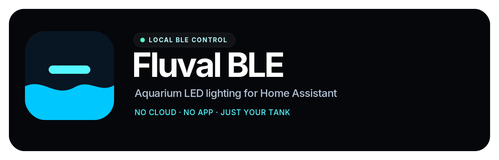

<p align="center">
  
</p>

<p align="center">
  <a href="https://github.com/MrMooreUK/fluvalble/actions/workflows/ci.yml"></a>
  <a href="https://github.com/MrMooreUK/fluvalble/releases"></a>
  <a href="https://github.com/MrMooreUK/fluvalble/blob/main/LICENSE"></a>
</p>

<p align="center">
  <strong>Premium local control for Fluval aquarium LED lights in Home Assistant.</strong><br/>
  No cloud. No vendor app dependency. Just Bluetooth, your tank, and automations that behave.
</p>

---

## Why Fluval BLE?

Fluval BLE turns compatible Fluval aquarium lights into first-class Home Assistant devices. Control colour and brightness through a normal `light` entity, plus mode and clock sync, while keeping every command local over Bluetooth Low Energy.

---

## Features

| Feature | Description |
|--------|-------------|
| **Local-first control** | Talk directly to the LED fixture over BLE; no internet, cloud account, or app login required. |
| **Light** | Real Home Assistant `light` entity with on/off, brightness, and colour. **Plant/Marine**: RGB picker translated to/from Rose·Blue·CW·PW·WW. **AquaSky**: native RGBW. |
| **Mode** | Select **Manual**, **Automatic**, or **Professional**. Changing colour or brightness switches to Manual when needed. |
| **Clock sync** | Syncs the lamp RTC on connect (and via a **Sync clock** button). |
| **Reachable** | Shows whether the lamp was seen recently over BLE (not the same as an idle GATT session). |
| **Auto-discovery** | Home Assistant detects nearby Fluval lights and prompts you to add them. |

Each device exposes one light as the primary control, plus mode, clock sync, and diagnostic sensors.

---

## Supported devices

Designed for Fluval aquarium LED fixtures that use BLE (Bluetooth Low Energy), including series such as:

- **Plant 3.0** (5 channels)
- **Reef 3.0** (5 channels)
- **Aquasky 2.0** (4 channels RGBW)
- **Aquasky 3.0 / FACEBD** (up to 5 channels)
- **Mesh (`fff0`)** CBOR lights (experimental)
- **Marine 3.0** (5 channels)
- Other 1st‑gen BLE Fluval LED lights

Your light must be controllable via the Fluval (e.g. FluvalSmart / FluvalConnect) app over Bluetooth. If the app can see and control it, this integration can too.

---

## Requirements

- **Home Assistant 2024.1.0** or later with a working **Bluetooth** stack (built-in or add-on Bluetooth adapter).
- The Fluval light must be in range and powered on so it advertises over BLE.
- Your HA host (or the machine running the Bluetooth proxy) must be able to see the light in BLE scans.

---

## Installation

### Option A: HACS (recommended)

1. Ensure [HACS](https://hacs.xyz/) is installed.
2. In HACS: **Integrations** → **⋮** → **Custom repositories**.
3. Add: `https://github.com/Wheemer/fluvalble`
   Type: **Integration**.
4. Search for **Fluval Aquarium LED** or **Fluval BLE**, then install.
5. Restart Home Assistant (needed once so HA loads the custom component modules).

### Option B: Manual

1. Download or clone this repo.
2. Copy the `custom_components/fluvalble` folder into your Home Assistant `custom_components` directory so you have:
   ```text
   config/
   └── custom_components/
       └── fluvalble/
           ├── __init__.py
           ├── manifest.json
           ├── config_flow.py
           ├── ...
   ```
3. Restart Home Assistant.

---

## Configuration

### Automatic (recommended)

When Home Assistant detects a Fluval light advertising over BLE, it will show a notification in **Settings → Devices & services** prompting you to set it up. Click **Configure**, confirm the device name, and the integration is ready.

### Manual

1. Go to **Settings** → **Devices & services** → **Add integration**.
2. Search for **Fluval Aquarium LED** (or **Fluval BLE**).
3. **Select your light** from the dropdown. The list shows only devices that look like Fluval lights (by Bluetooth service or name), so your aquarium light is easy to find. Ensure the light is **on** and in range before adding.
   - If your light appears: choose it and submit. The integration creates one device with the switch, channels, mode select, and connection sensor.
   - If it's not in the list: choose **"My device isn't in the list — enter MAC address manually"**, then enter the MAC (e.g. `AA:BB:CC:DD:EE:FF`). You can find the MAC in your phone's Bluetooth settings or the Fluval app.
4. After setup, the switch and other entities appear on the device. If you only see the integration card (e.g. "Update" / "Pre-release") and no switch, see [Troubleshooting](#troubleshooting) below.

No cloud account or app login is needed; the integration talks directly to the light over BLE.

---

## Lovelace dashboard cards

Optional dashboard cards are available for AquaSky 3.0 schedule editing,
spectrum bar preview, and wavelength preview. See
[`docs/lovelace-cards.md`](docs/lovelace-cards.md) for setup instructions,
example YAML, usage notes, and preview safety guidance.

---

## Entities

After setup you'll see one device with entities like:

| Entity | Display name | Purpose |
|--------|-------------|---------|
| **Light** | Light | Primary control — on/off, colour, brightness. |
| **Select** | Mode | Manual / Automatic / Professional. |
| **Button** | Sync clock | Re-sync the lamp RTC (also runs automatically on connect). |
| **Binary sensor** | Reachable | Lamp seen recently over BLE. |
| **Sensors** | Signal / Last seen / Diagnostics | RSSI, last advertisement time, BLE diagnostics. |

Entity IDs look like `light.b8_80_4f_3d_67_c0_light`. Find exact IDs under **Settings → Devices & services → Fluval Aquarium LED → entities**.

---

## Example automations

**Turn the tank light on at sunrise and off at sunset**

```yaml
- id: fluval_morning
  alias: "Tank light on at sunrise"
  trigger:
    - platform: sun
      event: sunrise
  action:
    - service: light.turn_on
      target:
        entity_id: light.b8_80_4f_3d_67_c0_light

- id: fluval_evening
  alias: "Tank light off at sunset"
  trigger:
    - platform: sun
      event: sunset
  action:
    - service: light.turn_off
      target:
        entity_id: light.b8_80_4f_3d_67_c0_light
```

**Dim the light when you're away**

```yaml
- id: fluval_away_dim
  alias: "Dim tank light when away"
  trigger:
    - platform: state
      entity_id:
        - person.you
      to: "not_home"
  action:
    - service: light.turn_on
      target:
        entity_id: light.b8_80_4f_3d_67_c0_light
      data:
        brightness_pct: 20
```

**Notify if the light is no longer reachable**

```yaml
- id: fluval_unreachable
  alias: "Tank light unreachable"
  trigger:
    - platform: state
      entity_id: binary_sensor.b8_80_4f_3d_67_c0_connection
      to: "off"
  action:
    - service: notify.mobile
      data:
        message: "Fluval tank light has not been seen over Bluetooth."
```

Replace entity IDs with yours, and `person.you` / `notify.mobile` with your actual entities.

---

## Troubleshooting

| Issue | What to try |
|-------|---------------------|
| **Integration not found** | Restart HA after installation. Ensure the `fluvalble` folder is directly under `custom_components`. |
| **Only see "Update" / "Pre-release", no switch or entities** | The device wasn't in the Bluetooth cache when the integration loaded. Remove the integration (delete the config entry), ensure the light is **on** and in range, then add the integration again and select your light from the dropdown. Restart HA after updating the integration. |
| **Cannot connect / no entities** | Confirm the light is on and in BLE range. Check that HA has Bluetooth enabled and that the adapter can see other BLE devices. Verify the MAC address (no typos, correct format AA:BB:CC:DD:EE:FF). |
| **My light isn't in the dropdown** | Ensure the light is on and advertising. Use "My device isn't in the list" and enter the MAC manually (from phone Bluetooth settings or the Fluval app). |
| **Lamp connected but doesn't respond to actions** | Try the Fluval app first to confirm the light works. If the app works but HA doesn't, open an issue with your model and HA logs. |
| **Switch doesn't turn light on/off** | Ensure the light model uses the same BLE command set. Try toggling once from the Fluval app, then again from HA. Restart HA and retry. |
| **Entities show "unavailable"** | The light may be out of range, off, or the BLE connection dropped. Move the light or HA adapter closer; check the connection binary sensor and RSSI. |
| **Wrong model or channel count** | Open **Configure** on the integration and set **Lamp type** (Plant 5ch / AquaSky 2.0 / AquaSky 3.0). Plant names are detected from the BLE advertisement; FACEBD and status packets refine channel count. |
| **Schedule wrong after power cut** | Use the **Sync clock** button (also runs automatically on connect). Keep Manual mode if you drive schedules from Home Assistant. |
| **Channels or mode don't update** | Some features (e.g. mode change) may require the device to send state back; if the firmware doesn't report mode, the dropdown may not reflect external changes. |
| **Channel sliders don't change the light** | See [Channel sliders troubleshooting](#channel-sliders-dont-change-the-light) below. |

### Channel sliders don't change the light

If the switch and mode work but brightness sliders have no effect:

1. **Enable debug logging** to see what's being sent. Add to `configuration.yaml`:
   ```yaml
   logger:
     default: info
     logs:
       custom_components.fluvalble: debug
   ```
   Restart HA, move a slider, then check **Settings → System → Logs** (or the full log file). Look for lines like:
   ```text
   Sending to XX:XX:XX:XX:XX:XX — raw: 68 04 03 e8 00 00 00 00 ... | encrypted: 54 ...
   ```
   - `raw` = command before encryption (e.g. `68 04` = brightness command, then channel bytes as 16-bit big-endian values)
   - `encrypted` = what goes over BLE

2. **Verify the Fluval app works** — If the app can change brightness, the hardware is fine; the protocol may differ for your model.

3. **Confirm you're in Manual mode** — The integration automatically switches to Manual when you adjust a slider, but if that switch command is dropped (e.g. connection is unstable), the brightness command will be ignored by the device. Switch to Manual via the select entity first, then adjust sliders.

4. **Check your model** — Different Fluval models (Plant 3.0, Reef 3.0, Aquasky 2.0, etc.) may use slightly different command formats. Open an issue with your model name and a log snippet showing the `raw` and `encrypted` bytes when you move a slider.

5. **Packet capture (advanced)** — Use an ESP32 or nRF Sniffer to capture BLE traffic while changing brightness in the Fluval app, then compare with what this integration sends.

If you have a different Fluval BLE model and the switch or other controls don't behave as expected, open an issue with your model name and (if possible) a note on what works in the official app.

---

## How it works

The integration uses Home Assistant's Bluetooth support to connect to the Fluval light. Commands (on/off, brightness, mode) are sent as small encrypted BLE packets; the encryption scheme is based on reverse‑engineered protocols used by Fluval's own app and community projects (e.g. [Fluval Plant 3.0 BLE protocol](https://www.plantedtank.net/threads/reverse-engineering-the-fluval-plant-3.0-ble-protocol.1325539/)). No data is sent to Fluval or any third party—everything stays between your HA instance and the fixture.

**BLE connection lifecycle:**
- On load the integration checks the HA Bluetooth cache for the device; if found it connects immediately.
- A keep-alive loop pings the light every 10 seconds to maintain the connection and flush any queued commands.
- If the connection drops, the integration reconnects automatically (several connect retries per command, then waits for the next BLE advertisement).
- The connection is cleanly closed after 2 minutes of inactivity (no commands sent).

---

## Credits & license

- Original integration structure and BLE work by [@mrzottel](https://github.com/mrzottel).
- Community reverse‑engineering of the Fluval BLE protocol (e.g. Planted Tank Forum, ESPHome/fluval projects).
- Licensed under the **Apache License 2.0**. See [LICENSE](LICENSE) in this repo.

---

**Enjoy your smarter aquarium lighting.**

*This README is the integration's main documentation and is kept up to date with each release in this repo.*
